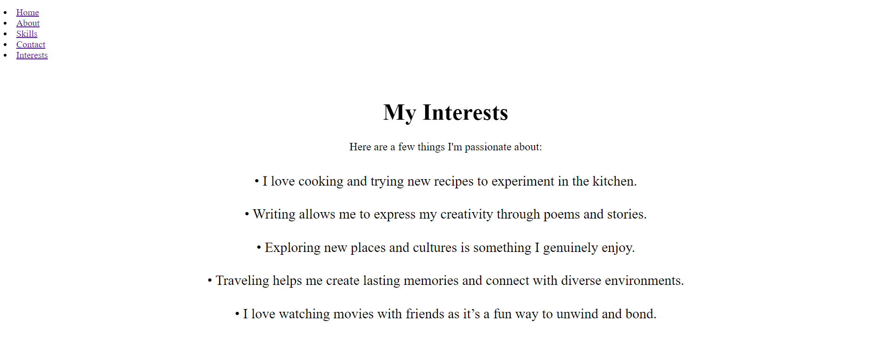

# ABOUT ME

## Overview
This is a simple web project created for fun, serving as a quick introduction about myself, Mannat Gupta. It showcases my interests, skills, and contact information in an engaging manner.

## Motivation
This project reflects my continuous journey of learning and self-improvement. It serves as a creative outlet for my thoughts, skills, and interests, and I hope you enjoy exploring it as much as I enjoyed creating it!

## Features
- Home page with a welcoming message
- About section detailing personal information
- Skills section highlighting interpersonal and technical skills
- Interests section showcasing hobbies and passions
- Contact section providing various ways to reach out

## Technologies Used
- **Frontend:** React.js
- **Styling:** Inline CSS for layout and design

## Demonstration
Here is the quick demo how it works:
1. Home


2. About


3. Skills


4. Contact


5. Interests 


## Installation
1. Clone the repository:
   ``` git clone https://github.com/yourusername/quick-introduction.git```

2. Navigate into the project directory:
```cd quick-introduction```

3. Install dependencies
``` npm install```

4. Start the development server
``` npm run dev```

5. Usage
``` http://localhost:5173```

## Feedback
I appreciate any feedback you have! Whether it’s suggestions for improvements, reporting bugs, or sharing your thoughts on the application, your input is invaluable.

## Contributing
Contributions are welcome! Feel free to open issues or submit pull requests.

## Future Improvements
1. Blog Section: Adding a blog to share thoughts and experiences with visitors.
2. Improved Styling: Enhancing the user interface for a better user experience.
3. Dynamic Content: Implementing API integration to fetch dynamic content, such as recent projects or articles.
4. Responsive Design: Ensuring the application is fully responsive for different devices.